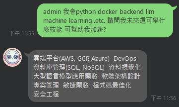
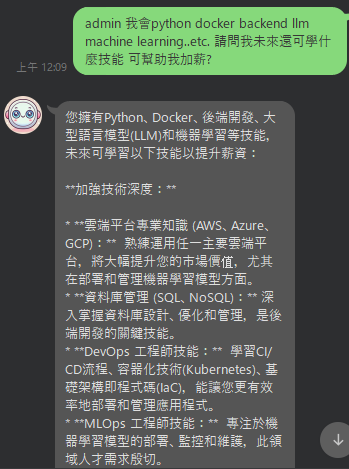
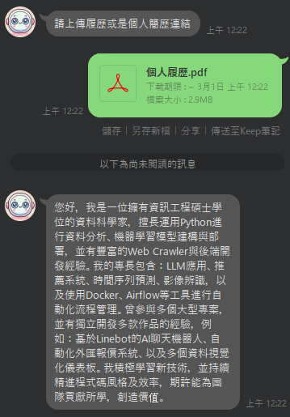
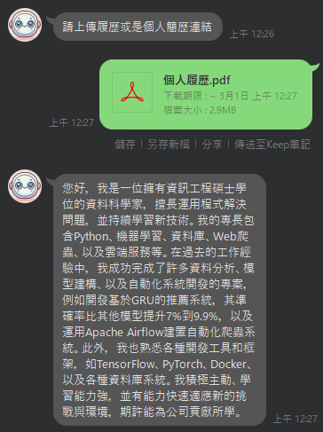
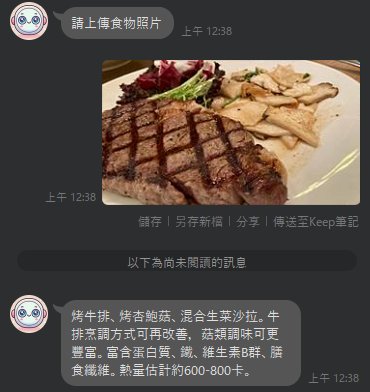
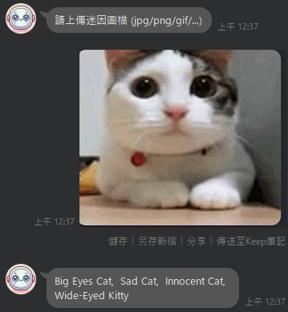

<a href='https://github.com/Junwu0615/PC-Bot-With-GenAI'> 
<a href='https://github.com/Junwu0615/PC-Bot-With-GenAI'> <br>
[](https://github.com/Junwu0615/PC-Bot-With-GenAI) 
[](https://github.com/Junwu0615/PC-Bot-With-GenAI) 
[](https://developers.line.biz/zh-hant/) 
[](https://ngrok.com/)
[](https://www.python.org/) <br>
[](https://pypi.org/project/requests/) 
[](https://pypi.org/project/Flask/) 
[](https://pypi.org/project/line-bot-sdk/) 

<br>

## *A.　Current progress*
| 項目 | 內容 | 完成時間 |
| :--: | :--: | :--:|
| 專案初次上架 | - | 2025-01-08 |
| 新增 `Google Gemini` 建置 | - | 2025-01-08 |
| 新增 `資料庫` 建置 | - | 2025-01-08 |
| 新增 `License` | Apache-2.0 license | 2025-01-14 |
| `Dockerization` | - | 2025-01-24 |
| NGROK `自動更新 Webhook` | - | 2025-02-02 |
| 變更隱私設定 | `PROPRIETARY PROJECT` to `OPEN SOURCE PROJECT` | 2025-02-16 |
| 專案`部署至 3 大公雲` | AWS / GCP / Azure | - |

<br>

## *B.　Showcase Results*
### *STEP.1　Add Linebot*


### *STEP.2　Try Function*
- #### *a. Creator’s GitHub*
- #### *b. Identify Food and Feedback*
- #### *c. GIF Meme Name Search*
- #### *d. Creator’s Dashboard*
- #### *e. Human Companion Robot*
- #### *f. Generate Self-Introduction*
- 

<br>

## *C.　Local Development*
### *STEP.1　Clone*
```py
git clone https://github.com/Junwu0615/PC-Bot-With-GenAI.git
```

### *STEP.2　Requirements*
```py
pip install -r requirements.txt
```

### *STEP.3　IDE 新增環境變數設定*
```commandline
SQL_SERVICE_DRIVER=17
SQL_SERVICE_BROKER_HOST=<Your SQL Server IP>,<YOUR SQL Server Port>
SQL_SERVICE_LOGIN_USER=<Your User Name>
SQL_SERVICE_LOGIN_PASSWORD=<Your User Password>
GEMINI_TOKEN=[Fill In Your Token]
GITHUB_PERSONAL_TOKEN=[Fill In Your Token]
LINE_ACCESS_TOKEN=[Fill In Your Access Token]
LINE_SECRET_TOKEN=[Fill In Your Secret]
SAVE_PATH=./preprocess
```

### *STEP.4　Run*
```py
python Entry.py
```

<br>

## *D.　Dockerization*

### *Directory Structure Diagram*
```commandline
PC-Bot-With-GenAI/docker
  ├── app
  │   │
  │   ├── package
  │   │   ├── __init__.py
  │   │   ├── gemini.py
  │   │   ├── linebot.py
  │   │   └── git_gist.txt
  │   │
  │   ├── Entry.py
  │   └── requirements.txt
  │
  └── script
      ├── .env
      ├── docker-compose.yaml
      └── Dockerfile
```

### *STEP.1　Clone*
```python
git clone https://github.com/Junwu0615/PC-Bot-With-GenAI.git
```

### *STEP.2　進入腳本路徑*
```bash
cd docker
```

### *STEP.3　新增檔案 : `./script/.env`*
```commandline
SQL_SERVICE_DRIVER=17
SQL_SERVICE_BROKER_HOST=<Your SQL Server IP>,<YOUR SQL Server Port>
SQL_SERVICE_LOGIN_USER=<Your User Name>
SQL_SERVICE_LOGIN_PASSWORD=<Your User Password>
SAVE_PATH=/builds/rep/preprocess
LINE_ACCESS_TOKEN=[Fill In Your Access Token]
LINE_SECRET_TOKEN=[Fill In Your Secret]
GEMINI_TOKEN=[Fill In Your Token]
GITHUB_PERSONAL_TOKEN=[Fill In Your Token]
NGROK_AUTHTOKEN=[Fill In Your Token]
DOCKER_BOOL=True
```

### *STEP.4　安裝 Dockerfile*
```bash
docker build -t pc-bot-with-genai:latest -f script/Dockerfile . --no-cache
```

### *STEP.5　docker-compose 啟動服務*
```bash
docker stack deploy -c script/docker-compose.yaml pc-bot-with-genai
```


### *STEP.6　檢視 docker service 清單*
```bash
docker service ls
```


### *STEP.7　查看 stack service 數量是否正確*
```bash
docker stack ls
```


### *STEP.8　查看專案 log 打印*
```bash
docker service logs -f pc-bot-with-genai_ngrok
```

```bash
docker service logs -f pc-bot-with-genai_task
```


## *E.　Prompt Engineering*
### *a.　專業的繁體中文職涯顧問*
- #### *Before*
    ```Text
    prompt = f"""
    你是一位專業的繁體中文職涯顧問
    問題內容: {msg}
    遵守下列條件:
    - 只顯示答覆結果，無贅詞，無多餘換行等
    - 請勿幻覺答覆
    """
    ```
- 

- #### *After*
  ```Text
  prompt = f"""
  我希望你扮演 "專業的繁體中文職涯顧問" 的角色。
  我會提供一位尋求職涯指導的個人給你，你的任務是幫助他們根據自己的技能、興趣和經驗確定最適合他們的職業。
  你還應該進行研究，解釋不同行業的就業市場趨勢，並建議追求特定領域所需的相關資格。
  * 問題內容: {msg}
  * 遵守下列條件:
  - 只顯示答覆結果，無贅詞，無多餘換行等。
  - 請勿幻覺答覆。
  - 字數限定 500 字內，非一定要達滿 500 字。
  """
  ```
- 

### *b.　基於履歷生成字介簡述*
- #### *Before*
    ```Text
    prompt = f"""
    你是一位專業的繁體中文職涯顧問，基於求職者給予的履歷生成簡潔的自我介紹。
    * 求職者欲投職缺: {file1}
    * 遵守下列條件:
    - 只顯示答覆結果，無贅詞，無多餘換行等。
    - 請勿幻覺答覆。
    """
    ```
- 

- #### *After*
  ```Text
  prompt = f"""
  我希望你扮演 "專業的繁體中文職涯顧問" 的角色。
  我會提供一份求職者的履歷給你，你的任務是基於給予的履歷生成簡潔且符合事實的自我介紹。
  * 求職者欲投職缺: {file1}
  * 遵守下列條件:
  - 只顯示答覆結果，無贅詞，無多餘換行等。
  - 請勿幻覺答覆。
  - 字數限定 500 字內，非一定要達滿 500 字。
  """
  ```
- 

### *c.　基於識別食物並給予營養反饋*
```Text
prompt = f"""
我希望你扮演 "美食家兼營養學大師" 的角色。
* 你收到一張食物圖，描述看到哪些食物。
* 這些食物是否有改善空間。
* 評估可能富含的營養成分。
* 推估可能的熱量。
* 遵守下列條件:
- 只顯示答覆結果，無贅詞，無多餘換行等
- 無法識別也明確答覆
- 請勿幻覺答覆
"""
```


### *d.　迷因圖片搜尋*
```Text
prompt = f"""
我希望你扮演 "閱覽無數個迷因內容的迷因大師" 的角色。
* 這張迷因圖可能的名稱?
* 遵守下列條件:
- 名稱用[英文表達]
- 只顯示答覆結果，無贅詞，無多餘換行等
- 請勿幻覺答覆
"""
```


## *F.　Reference*
- ### [*20 種提問模板 + 6 個提示詞網站*](https://dashempower.co/tools/ai-applications/chatgpt-prompts/#google_vignette)
- ### [*提示工程指南：6 大關鍵原則！*](https://solwen.ai/posts/what-is-prompt-engineering)