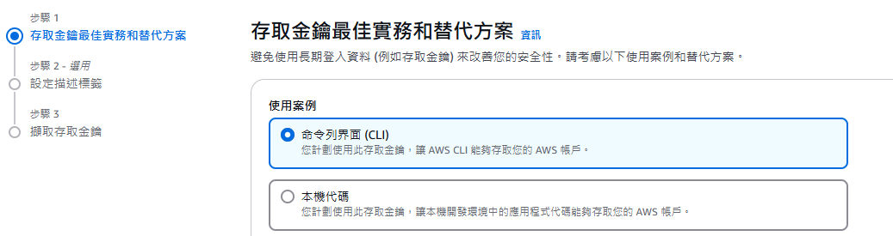

<a href='https://github.com/Junwu0615/PC-Bot-With-GenAI'> 
<a href='https://github.com/Junwu0615/PC-Bot-With-GenAI'> <br>
[](https://github.com/Junwu0615/PC-Bot-With-GenAI) 
[](https://github.com/Junwu0615/PC-Bot-With-GenAI)
[](https://www.python.org/) 
[](https://www.microsoft.com/zh-tw/software-download/windows10) <br>
[](https://aws.amazon.com/) 
[](https://azure.microsoft.com/zh-tw) 
[](https://cloud.google.com/) 
[](https://developers.line.biz/zh-hant/) 
[](https://ngrok.com/) <br>
[](https://www.microsoft.com/zh-tw/sql-server/sql-server-downloads)
[](https://pypi.org/project/requests/) 
[](https://pypi.org/project/Flask/) 
[](https://pypi.org/project/line-bot-sdk/) 

<br>

## *⭐ Amazon Web Services ⭐*

### *Notice.　與 Docker 版本差異在於 `取消 DB 存取設置`*

### *A.　Directory Structure Diagram ( 部署後實際內部結構 )*
```commandline
PC-Bot-With-GenAI/deploy/aws
  ├── .gitkeep
  ├── vm_genai_bot.pem
  ├── CLI_worker_accessKeys.csv
  ├── app
  │   │
  │   ├── package
  │   │   ├── __init__.py
  │   │   ├── gemini.py
  │   │   ├── linebot.py
  │   │   └── git_gist.txt
  │   │
  │   ├── Entry.py
  │   ├── preprocess
  │   └── requirements.txt
  │
  └── script
      ├── .env
      ├── docker-compose.yaml
      └── Dockerfile
```

<br>

### *B.　[Download CLI](https://docs.aws.amazon.com/cli/latest/userguide/getting-started-install.html)*
### *STEP1.　下載 msi*


### *STEP2.　安裝*


### *STEP3.　確認是否安裝成功*
```bash
aws --version
```


<br>

### *✔️ C.　Deploy ( EC2 VM )*

### *Notice: Linux 常見指令或快捷鍵*
```Text
# 貼上: shift + ins
# 強制刪除檔案夾: sudo rm -rf PC-Bot-With-GenAI
# 檢視當前目錄(包含隱藏檔案): ls -a
# 創建 preprocess 檔案夾: mkdir preprocess
# 檢視檔案: script/.env
# 編輯文件: # 開始編輯: cat <<EOF > script/.env # 結束編輯: EOF
# 複製檔案夾: cp -r common aws/
```

### *STEP1.　[UI 介面創立 VM](https://aws.amazon.com/)*


### *STEP2.　新增使用 CLI 使用者*
- #### *a　新增用戶*
    
    
    
    

- #### *b　申請金鑰*
    
    

- #### *c　務必記住金鑰 ( 保存 csv )*
    

- #### *d　新增必要權限*
    

- #### *e　初始化 CLI*
    ```bash
    aws configure
    # Access key ID
    # Secret access key
    # Default region name → ap-southeast-2
    # Default output format → 按 Enter
    ```
    
    

- #### *f　測試權限*
    ```bash
    aws ec2 describe-instances
    ```
    

### *STEP3.　連線到 EC2 VM*
```bash
# vm_genai_bot_key.pem → [SSH 金鑰]
# ubuntu → [Ubuntu 使用者]
# 54.206.113.236 → [EC2 的 Public IPv4]
ssh -i vm_genai_bot.pem ubuntu@54.206.113.236
```


### *STEP4.　在 VM 進行必要安裝，啟動 USER 權限，最後離開 VM*
```bash
sudo apt update && sudo apt install -y docker.io docker-compose git
sudo systemctl enable docker
sudo systemctl start docker
sudo usermod -aG docker $USER
exit
```


### *STEP5.　重新進入 VM，並 Clone 專案*
```bash
ssh -i vm_genai_bot.pem ubuntu@54.206.113.236
git clone https://github.com/Junwu0615/PC-Bot-With-GenAI.git
```


### *STEP6.　新增必要檔案並進入腳本路徑*
```bash
ls -a # 確認目錄檔案
cd PC-Bot-With-GenAI/deploy
cp -r common aws/ # 複製欲使用腳本
cd aws/common/ # 進入目錄
mkdir app/preprocess/ # 創建檔案夾
```

### *STEP7.　啟動 docker swarm 和 docker network*
```bash
docker swarm init
docker network create --driver=overlay open_network
```

### *STEP8.　新增 .env*
```bash
cat <<EOF > script/.env # 開始編輯
# -- 輸入變數 --
SQL_SERVICE_DRIVER=''
SQL_SERVICE_BROKER_HOST=''
SQL_SERVICE_LOGIN_USER=''
SQL_SERVICE_LOGIN_PASSWORD=''
SAVE_PATH=/builds/app/preprocess
LINE_ACCESS_TOKEN=[Fill In Your Access Token]
LINE_SECRET_TOKEN=[Fill In Your Secret]
GEMINI_TOKEN=[Fill In Your Token]
GITHUB_PERSONAL_TOKEN=[Fill In Your Token]
NGROK_AUTHTOKEN=[Fill In Your Token]
DOCKER_BOOL=True
# -- 輸入變數 --
EOF # 結束編輯
cat script/.env # 查看檔案
```

### *STEP9.　build images & compose up*
```bash
docker build -t pc-bot-with-genai:latest -f script/Dockerfile . --no-cache
docker stack deploy -c script/docker-compose.yaml pc-bot-with-genai
```


### *STEP10.　檢視運行狀態*
```bash
docker ps -a
docker images -a
docker stack ls
docker service ls
docker service logs -f pc-bot-with-genai_ngrok
docker service logs -f pc-bot-with-genai_task
```

