<a href='https://github.com/Junwu0615/PC-Bot-With-GenAI'> 
<a href='https://github.com/Junwu0615/PC-Bot-With-GenAI'> <br>
[](https://github.com/Junwu0615/PC-Bot-With-GenAI) 
[](https://github.com/Junwu0615/PC-Bot-With-GenAI)
[](https://www.python.org/) 
[](https://www.microsoft.com/zh-tw/software-download/windows10) <br>
[](https://aws.amazon.com/) 
[](https://azure.microsoft.com/zh-tw) 
[](https://cloud.google.com/) 
[](https://developers.line.biz/zh-hant/) 
[](https://ngrok.com/) <br>
[](https://www.microsoft.com/zh-tw/sql-server/sql-server-downloads)
[](https://pypi.org/project/requests/) 
[](https://pypi.org/project/Flask/) 
[](https://pypi.org/project/line-bot-sdk/) 

<br>

## *⭐ Google Cloud Platform ⭐*

### *Notice.　與 Docker 版本差異在於 `取消 DB 存取設置`*

### *A.　Directory Structure Diagram ( 部署後實際內部結構 )*
```commandline
PC-Bot-With-GenAI/deploy/gcp
  ├── .gitkeep
  ├── app
  │   │
  │   ├── package
  │   │   ├── __init__.py
  │   │   ├── gemini.py
  │   │   ├── linebot.py
  │   │   └── git_gist.txt
  │   │
  │   ├── Entry.py
  │   ├── preprocess
  │   └── requirements.txt
  │
  └── script
      ├── .env
      ├── docker-compose.yaml
      └── Dockerfile
```

<br>

### *B.　Deploy Way*
| 方案 | 適合情境 | 運行方式 | 自動擴展 | 成本 | 管理難度 |
| -- | -- | -- | -- | -- | :--: |
| Cloud Run | 小型應用、快速部署、事件驅動應用 | 無伺服器 ( Serverless ) ，直接部署容器 | 自動擴展 ( 0 ~ N ) | 按請求計費，閒置不收費 | ⭐<br>( 最簡單 ) |
| Compute Engine: VM | 高度自訂需求、傳統應用、需要完整 VM 控制 | 直接運行在 VM 上 | 需要自行設定負載均衡 | 依照 VM 規格與運行時間計費 | ⭐⭐<br>( 需管理 VM ) |
| GKE ( Kubernetes Engine ) | 大型應用、微服務架構、需要 K8s | 需要自行建立 Kubernetes Cluster | 可自動擴展 ( 需設定 HPA ) | 計費基於 VM、磁碟、網路等資源 | ⭐⭐⭐<br>( 需管理 K8s ) |

<br>

### *✔️ C.　Deploy ( Compute Engine: VM )*

### *Notice: Linux 常見指令或快捷鍵*
```Text
# 貼上: shift + ins
# 強制刪除檔案夾: sudo rm -rf PC-Bot-With-GenAI
# 檢視當前目錄(包含隱藏檔案): ls -a
# 創建 preprocess 檔案夾: mkdir preprocess
# 檢視檔案: script/.env
# 編輯文件: # 開始編輯: cat <<EOF > script/.env # 結束編輯: EOF
# 複製檔案夾: cp -r common gcp/
```

### *STEP1.　[Installation SDK](https://cloud.google.com/sdk/docs/install-sdk)*
```bash
(New-Object Net.WebClient).DownloadFile("https://dl.google.com/dl/cloudsdk/channels/rapid/GoogleCloudSDKInstaller.exe", "$env:Temp\GoogleCloudSDKInstaller.exe")

& $env:Temp\GoogleCloudSDKInstaller.exe
```
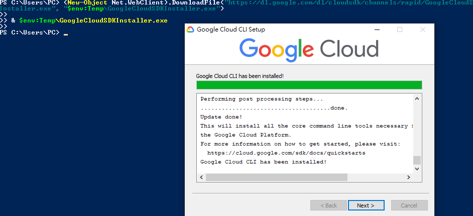

### *STEP2.　Y 授權帳戶*
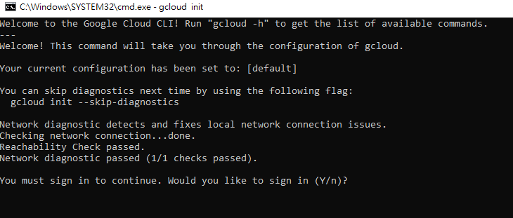

### *STEP3.　選擇欲使用專案 ( 若無則先忽略 )*
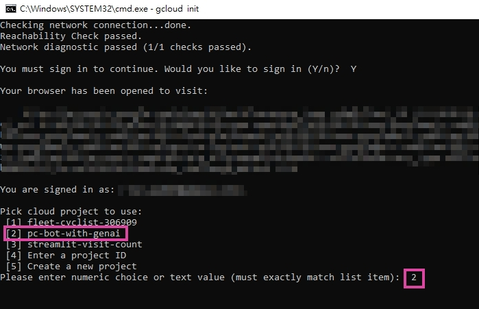
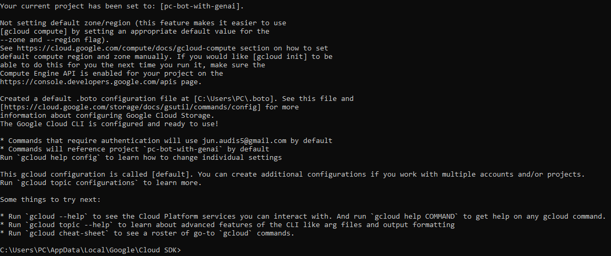

### *STEP4.　查詢專案 ID 並切換專案 ( UI 介面創立專案後，執行此步驟 )*
```bash
# [YOUR_PROJECT_ID] → vm-genai-bot 
gcloud projects list
gcloud config set project vm-genai-bot
```
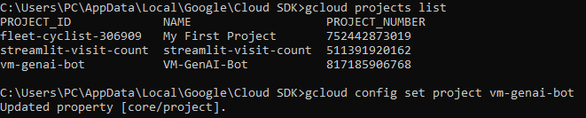

### *STEP5.　用 UI 介面創立 VM*
- 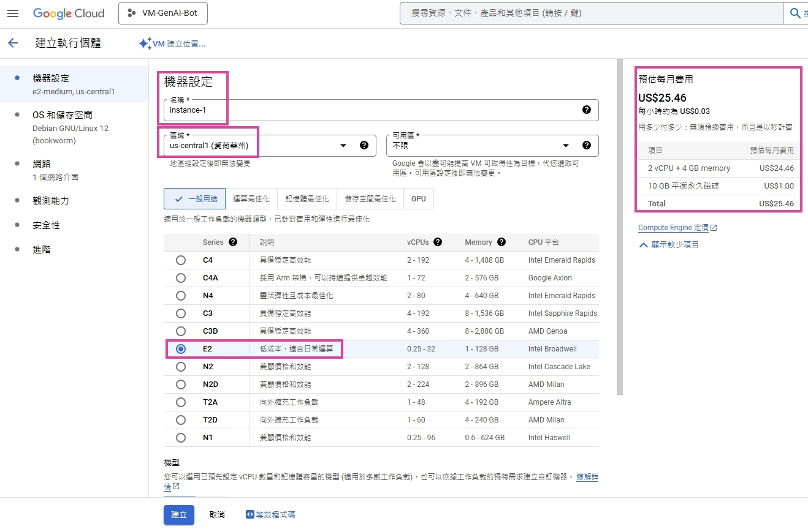
- 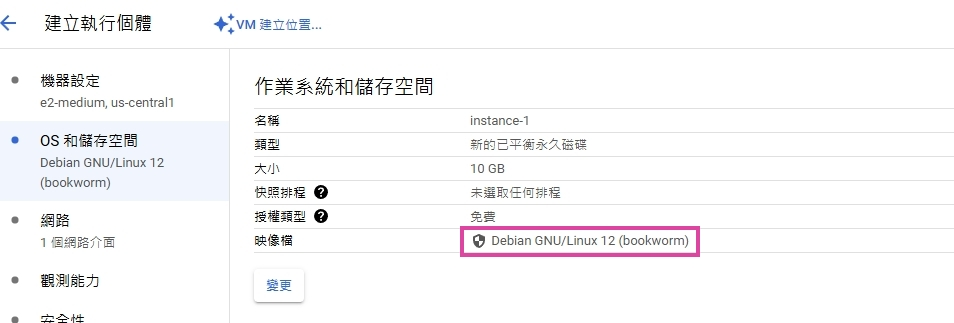
- 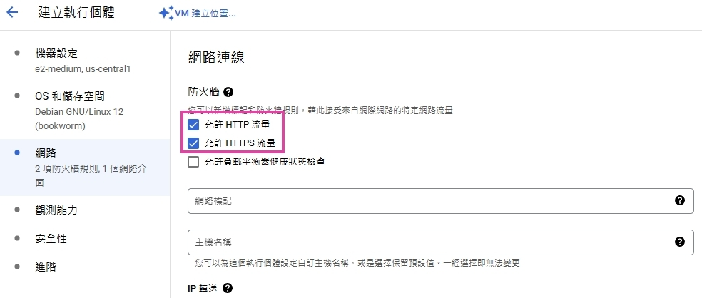
- 點擊建立

### *STEP6.　查詢 VM ID 並切換 VM*
```bash
# [你的VM名稱] → instance-1 # [你的VM區域] → us-central1-c
gcloud compute instances list
gcloud compute ssh instance-1 --zone=us-central1-c
```
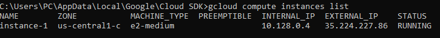
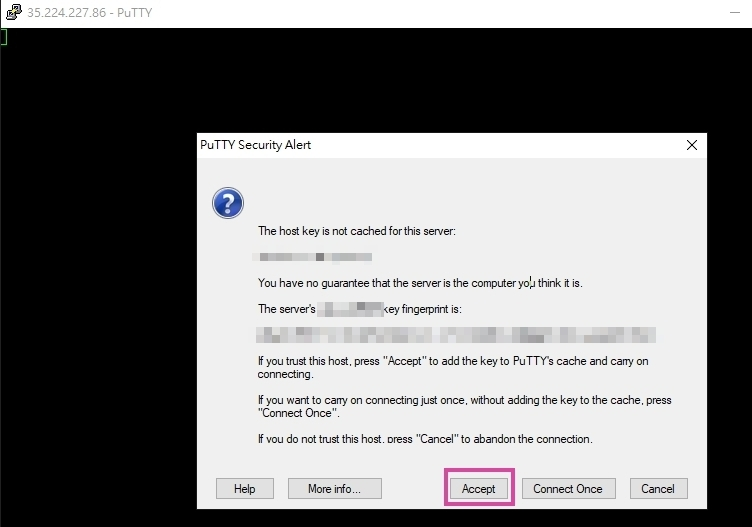
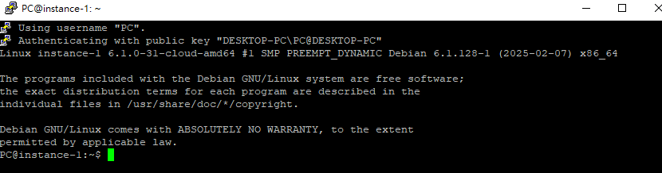

### *STEP7.　在 VM 進行必要安裝，啟動 USER 權限，最後離開 VM*
```bash
sudo apt update && sudo apt install -y docker.io docker-compose git
sudo systemctl enable docker
sudo systemctl start docker
sudo usermod -aG docker $USER
exit
```
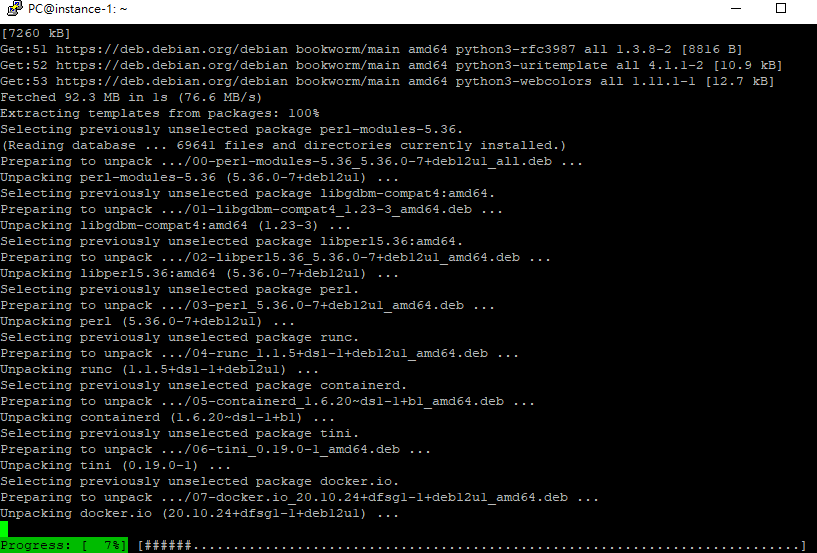

### *STEP8.　重新進入 VM，並 Clone 專案*
```bash
# [你的VM名稱] → instance-2 # [你的VM區域] → us-central1-c
gcloud compute ssh instance-2 --zone=us-central1-c
git clone https://github.com/Junwu0615/PC-Bot-With-GenAI.git
```

### *STEP9.　新增必要檔案並進入腳本路徑*
```bash
ls -a # 確認目錄檔案
cd PC-Bot-With-GenAI/deploy
cp -r common gcp/ # 複製欲使用腳本
cd gcp/common/ # 進入目錄
mkdir app/preprocess/ # 創建檔案夾
```

### *STEP10.　啟動 docker swarm 和 docker network*
```bash
docker swarm init
docker network create --driver=overlay open_network
```

### *STEP11.　新增 .env*
```bash
cat <<EOF > script/.env # 開始編輯
# -- 輸入變數 --
SQL_SERVICE_DRIVER=''
SQL_SERVICE_BROKER_HOST=''
SQL_SERVICE_LOGIN_USER=''
SQL_SERVICE_LOGIN_PASSWORD=''
SAVE_PATH=/builds/app/preprocess
LINE_ACCESS_TOKEN=[Fill In Your Access Token]
LINE_SECRET_TOKEN=[Fill In Your Secret]
GEMINI_TOKEN=[Fill In Your Token]
GITHUB_PERSONAL_TOKEN=[Fill In Your Token]
NGROK_AUTHTOKEN=[Fill In Your Token]
DOCKER_BOOL=True
# -- 輸入變數 --
EOF # 結束編輯
cat script/.env # 查看檔案
```

### *STEP12.　build images & compose up*
```bash
docker build -t pc-bot-with-genai:latest -f script/Dockerfile . --no-cache
docker stack deploy -c script/docker-compose.yaml pc-bot-with-genai
```
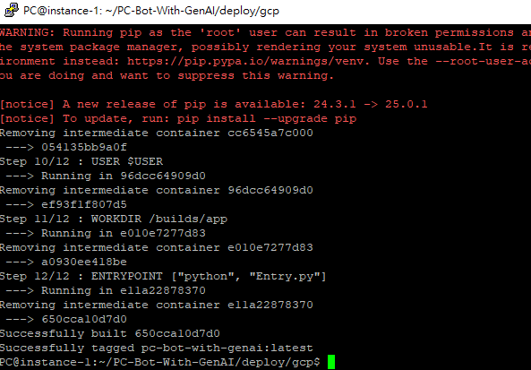
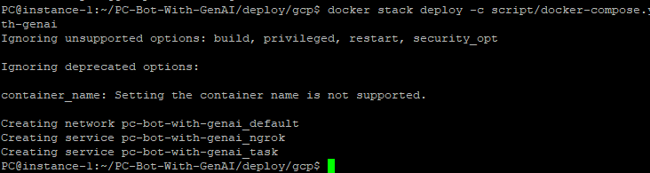

### *STEP13.　檢視運行狀態*
```bash
docker ps -a
docker images -a
docker stack ls
docker service ls
docker service logs -f pc-bot-with-genai_ngrok
docker service logs -f pc-bot-with-genai_task
```
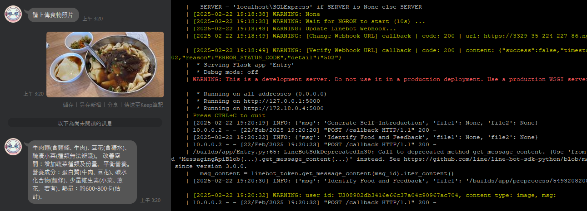
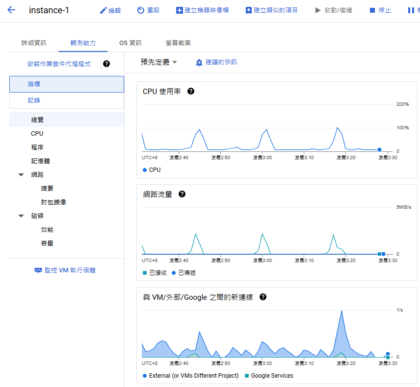

<br>

### *❌ D.　Deploy ( Cloud Run )*

### *STEP1.　[Installation SDK](https://cloud.google.com/sdk/docs/install-sdk)*
```bash
(New-Object Net.WebClient).DownloadFile("https://dl.google.com/dl/cloudsdk/channels/rapid/GoogleCloudSDKInstaller.exe", "$env:Temp\GoogleCloudSDKInstaller.exe")

& $env:Temp\GoogleCloudSDKInstaller.exe
```


### *STEP2.　Y 授權帳戶*


### *STEP3.　選擇欲使用專案*


### *STEP4.　啟用 API*
```bash
# pc-bot-with-genai → [YOUR_PROJECT_ID]
gcloud projects list
gcloud config set project [YOUR_PROJECT_ID]
gcloud services enable run.googleapis.com artifactregistry.googleapis.com
```
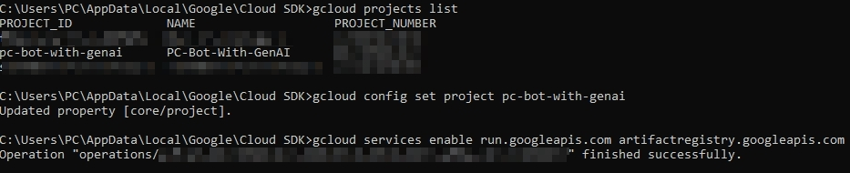

### *STEP5.　設定 GCP 區域*
```bash
gcloud config set run/region asia-east1 # 台灣區域
```

### *STEP6.　建立 Artifact Registry 儲存庫*
```bash
# 在 asia-east1 建立一個 pc-bot Docker 映像儲存庫
gcloud artifacts repositories create pc-bot --location=asia-east1 --repository-format=docker
```
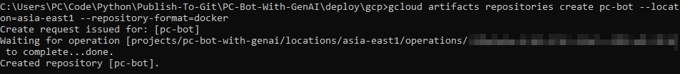

### *STEP7.　進入腳本路徑*
```bash
cd .\deploy\gcp\
```

### *STEP8.　設定 Docker 登入*
```bash
gcloud auth configure-docker asia-east1-docker.pkg.dev
```
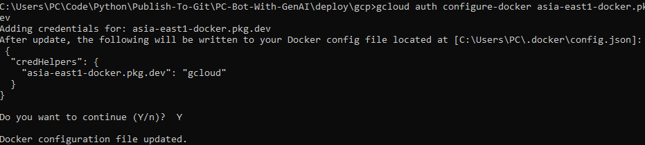

### *STEP9.　建立 Docker Images*
```bash
# pc-bot-with-genai → [YOUR_PROJECT_ID]
docker build -t asia-east1-docker.pkg.dev/pc-bot-with-genai/pc-bot:v1.0.1 -f script/Dockerfile . --no-cache
```
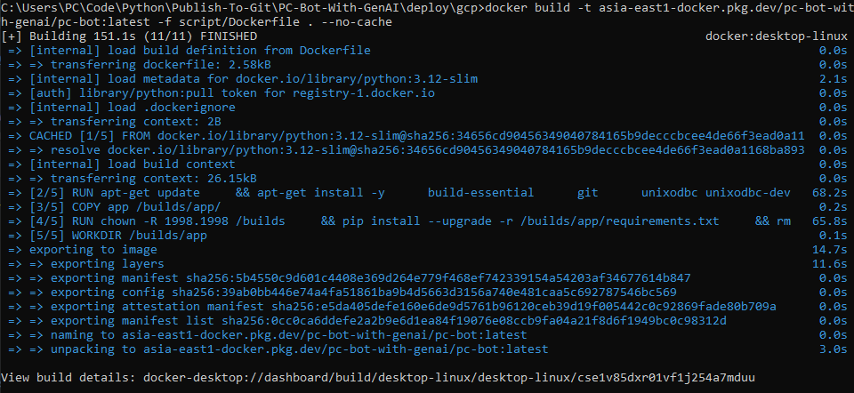
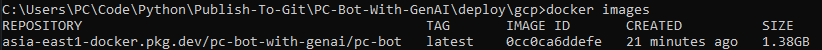

### *❌ STEP10.　推送 Docker Images 到 GCP Artifact Registry*
```bash
# pc-bot-with-genai → [YOUR_PROJECT_ID]
docker push asia-east1-docker.pkg.dev/pc-bot-with-genai/pc-bot:v1.0.1
```
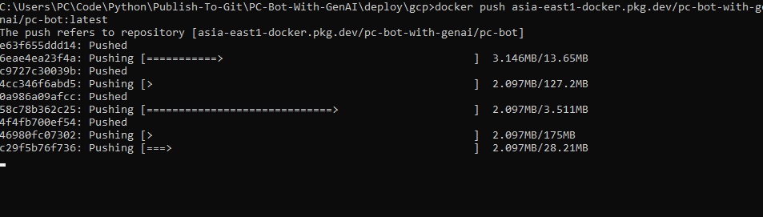
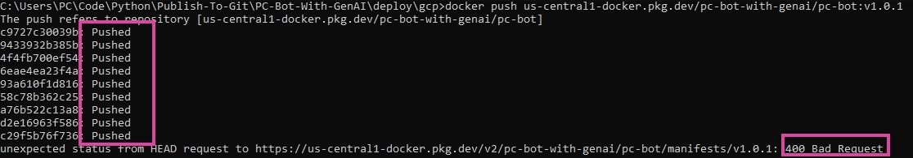

### *❌ STEP11.　部署到 Cloud Run*
```bash
# pc-bot-with-genai → [YOUR_PROJECT_ID]
gcloud run deploy pc-bot --image asia-east1-docker.pkg.dev/pc-bot-with-genai/pc-bot:v1.0.1 --platform managed --region asia-east1 --allow-unauthenticated

gcloud run deploy ngrok --image wernight/ngrok --platform managed --region us-central1 --allow-unauthenticated
```

### *❌ STEP12.　監控與管理*
- #### 查看日誌
    ```bash
    gcloud logging read "resource.type=cloud_run_revision"
    ```
- #### 更新服務
    ```bash
    docker build -t asia-east1-docker.pkg.dev/pc-bot-with-genai/pc-bot:v1.0.1 -f script/Dockerfile . --no-cache
    docker push asia-east1-docker.pkg.dev/pc-bot-with-genai/pc-bot:v1.0.1
    gcloud run deploy pc-bot --image asia-east1-docker.pkg.dev/pc-bot-with-genai/pc-bot:v1.0.1 --platform managed --region asia-east1 --allow-unauthenticated
    ```

<br>

### *E.　Other Command*
### *確認已登入帳戶*
```bash
gcloud auth list
```

### *確認既有專案 ID*
```bash
gcloud projects list
```

### *確認 API 已啟用*
```bash
gcloud services list --enabled --filter="artifactregistry.googleapis.com"
```

### *確認 Artifact Registry 是否存在*
```bash
# location # asia-east1 # 預期 pc-bot
gcloud artifacts repositories list --location=asia-east1
```

### *確認 IAM 權限 ( 確保帳戶有權限推送 Docker Images )*
```bash
gcloud projects get-iam-policy pc-bot-with-genai --flatten="bindings[].members" --format="table(bindings.role, bindings.members)"
```

### *更新 IAM 權限*
```bash
# jun.audis5@gmail.com → [YOUR_GMAIL]
gcloud projects add-iam-policy-binding pc-bot-with-genai --member=user:jun.audis5@gmail.com --role=roles/artifactregistry.admin
gcloud projects add-iam-policy-binding pc-bot-with-genai --member=user:jun.audis5@gmail.com --role=roles/artifactregistry.writer
```

### *重新登入*
```bash
# jun.audis5@gmail.com → [YOUR_GMAIL]
gcloud auth revoke # 取消目前已登入的 Google 帳戶授權
gcloud auth login #  重新授權
gcloud config set account jun.audis5@gmail.com
gcloud auth configure-docker asia-east1-docker.pkg.dev # asia-east1 = location 
```

### *替換 Tag*
```bash
docker tag asia-east1-docker.pkg.dev/pc-bot-with-genai/pc-bot:latest asia-east1-docker.pkg.dev/pc-bot-with-genai/pc-bot:v1.0.1
```

### *嘗試直接拉取不存在的 Images ( 確保有權限存取 )*
```bash
docker pull asia-east1-docker.pkg.dev/pc-bot-with-genai/pc-bot:non-existent
```

### *更新 gcloud*
```bash
gcloud components update
```

### *刪除並重新建立 pc-bot 儲存庫*
```bash
gcloud artifacts repositories delete pc-bot --location=asia-east1 --quiet
gcloud artifacts repositories create pc-bot --location=asia-east1 --repository-format=docker
```

### *確認儲存庫的 Images List*
```bash
gcloud artifacts docker images list asia-east1-docker.pkg.dev/pc-bot-with-genai/pc-bot
```